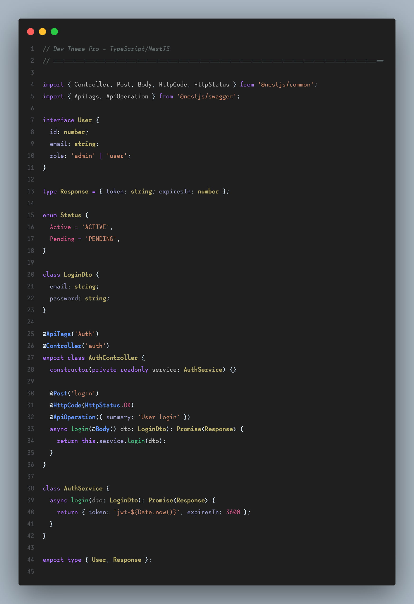
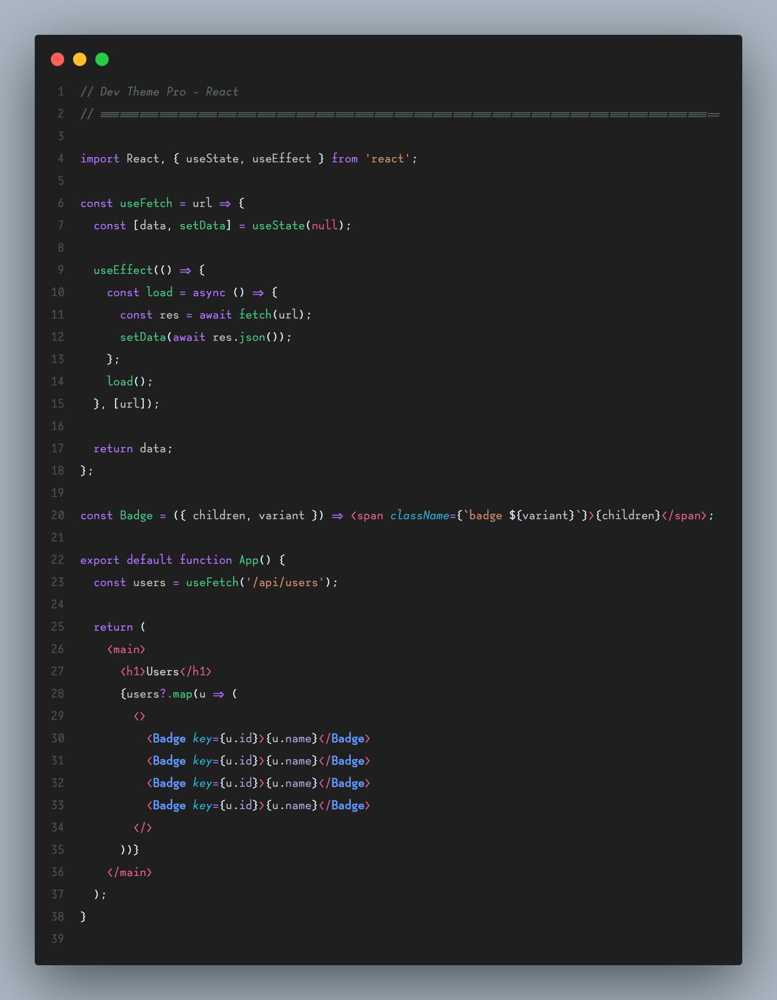
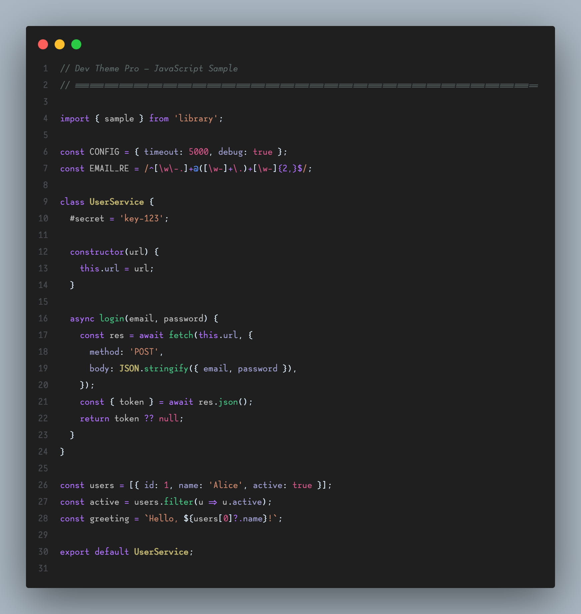
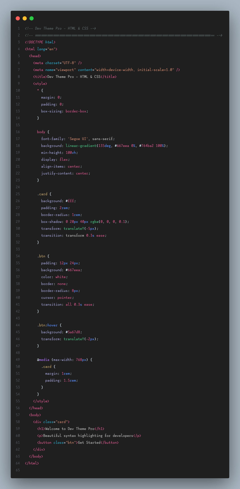

<h1 align="center">
  <br>
  
  <br><br>
  Dev Theme Pro
  <br>
</h1>

<h4 align="center">A beautiful dark theme with colorful syntax highlighting for VS Code.</h4>

<p align="center">
  <a href="https://marketplace.visualstudio.com/items?itemName=FaizanAshiq.dev-theme-pro">
    
  </a>&nbsp;
  <a href="https://marketplace.visualstudio.com/items?itemName=FaizanAshiq.dev-theme-pro">
    
  </a>&nbsp;
  <a href="https://marketplace.visualstudio.com/items?itemName=FaizanAshiq.dev-theme-pro">
    
  </a>&nbsp;
  <a href="https://marketplace.visualstudio.com/items?itemName=FaizanAshiq.dev-theme-pro">
    
  </a>
</p>

<br>

## Screenshots










## Installation

1. Open the **Extensions** sidebar in VS Code (`Ctrl+Shift+X` / `Cmd+Shift+X`)
2. Search for **Dev Theme Pro**
3. Click **Install**
4. Go to `File → Preferences → Color Theme` (or `Code → Settings → Theme → Color Theme` on macOS)
5. Select **Dev Theme Pro Smooth**
6. ⭐⭐⭐⭐⭐ Rate five-stars if you enjoy it!

## Customization

If you want to tweak colors, add this to your `settings.json`:

```json
"workbench.colorCustomizations": {
  "[Dev Theme Pro Smooth]": {
    "editor.background": "#1a1a2e",
    "sideBar.background": "#1a1a2e"
  }
}
```

### Recommended Settings

```json
"editor.fontFamily": "Lotion, Fira Code, JetBrains Mono",
"editor.fontLigatures": true,
"editor.fontSize": 14,
"editor.lineHeight": 30
```

### Enable Italics

```json
"editor.tokenColorCustomizations": {
  "[Dev Theme Pro Smooth]": {
    "textMateRules": [
      {
        "scope": ["comment", "keyword", "storage.modifier"],
        "settings": { "fontStyle": "italic" }
      }
    ]
  }
}
```

---

## Changelog

See [CHANGELOG.md](CHANGELOG.md) for release notes.

## Issues & Suggestions

Found a bug or have a feature request?  
👉 [Open an issue on GitHub](https://github.com/FaizanAshiq/dev-theme-pro/issues)

## Author

**Faizan Ashiq** — [LinkedIn](https://www.linkedin.com/in/faizan-ashiq/) · [GitHub](https://github.com/FaizanAshiq)

## License

[MIT License](LICENSE.txt) © 2025 Faizan Ashiq

---

<p align="center">
  <strong>Enjoy coding with Dev Theme Pro!</strong><br>
  If you like this theme, please ⭐ star the repo and leave a review on the <a href="https://marketplace.visualstudio.com/items?itemName=FaizanAshiq.dev-theme-pro">VS Code Marketplace</a>.
</p>
