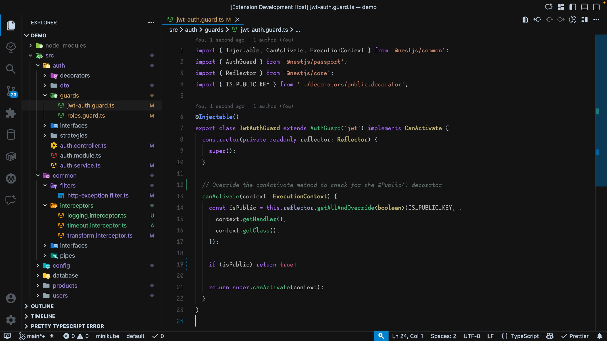

# Dev Theme Pro 🔮

> The endgame VS Code theme. Built for developers who refuse to compromise between aesthetics and readability.

<p align="center">
  
</p>

Dev Theme Pro is not just another dark theme. Every color, every border, every shadow — obsessively tuned so your code looks exactly as good as it runs. Colorful without being chaotic. Dark without being flat. Readable without being boring.

**8 variants.** Pick your accent, your depth, your style — and feel the difference.

---

## Theme Variants

**2 Accents** × **2 Depths** × **2 Styles** = **8 themes**

|               | ☁️ Mist Pure | ☁️ Mist Wire | ✨ Void Pure | ✨ Void Wire |
| ------------- | ------------ | ------------ | ------------ | ------------ |
| 🌊 **Ocean**  | ✓            | ✓            | ✓            | ✓            |
| 🔮 **Nebula** | ✓            | ✓            | ✓            | ✓            |

### Accents

- 🌊 **Ocean** — deep blue (`#0083CF`). Calm, focused, professional.
- 🔮 **Nebula** — rich purple (`#864DEF`). Vibrant, bold, expressive.

### Depths

- ☁️ **Mist** — background `#1F1F1F`. Comfortable for long sessions.
- ✨ **Void** — background `#141414`. Maximum contrast. Maximum focus.

### Styles

- **Wire** — structured layout with full borders and indent guides. Traditional and sharp.
- **Pure** — borderless. Every panel, every separator, every dividing line — gone. Only the active indent scope and the active tab indicator remain. Distraction-free, floating UI.

---

## Why Dev Theme Pro?

- **Syntax colors that mean something** — keywords, functions, types, strings, constants — each has its own deliberate color. No guessing what you're looking at.
- **Consistent UI-wide accent** — the selected file in the tree, the focused item in the command palette, the highlighted row in autocomplete — all use the exact same accent highlight. No visual inconsistency anywhere.
- **Inlay hints and hover popups done right** — they match the editor background and define themselves with a subtle border, not by screaming with a different color. Clean and readable.
- **Two distinct modes for two different minds** — Wire if you like structure. Pure if you like silence.
- **Every detail considered** — scrollbars, diff gutter, git status, terminal colors, bracket highlights, minimap, diagnostics — nothing is left at a default.

---

## Screenshots

### Editor Preview



---

## Installation

### From the Marketplace

1. Open VS Code → Extensions (`Ctrl+Shift+X` / `Cmd+Shift+X`)
2. Search **Dev Theme Pro**
3. Click Install
4. `File → Preferences → Color Theme` → pick any **Dev Theme Pro** variant

### Manual

1. Download or clone this repo
2. Copy the folder into your VS Code extensions directory
3. Reload VS Code and select the theme

---

## Recommended Settings

```json
"editor.fontFamily": "Lotion, Fira Code, JetBrains Mono",
"editor.fontLigatures": true,
"editor.fontSize": 14,
"editor.lineHeight": 30
```

---

## Changelog

See [CHANGELOG.md](CHANGELOG.md) for full release notes.

## Issues & Suggestions

Found something off? Have an idea?  
👉 [Open an issue on GitHub](https://github.com/FaizanAshiq/dev-theme-pro/issues)

## Author

**Faizan Ashiq** — [LinkedIn](https://www.linkedin.com/in/faizanashiq/) · [GitHub](https://github.com/FaizanAshiq)

## License

MIT © 2025-2026 Faizan Ashiq — [Full License](LICENSE.txt)

---

**If Dev Theme Pro is your daily driver, please leave a ⭐ review on the [VS Code Marketplace](https://marketplace.visualstudio.com/items?itemName=FaizanAshiq.dev-theme-pro). It means a lot.**
