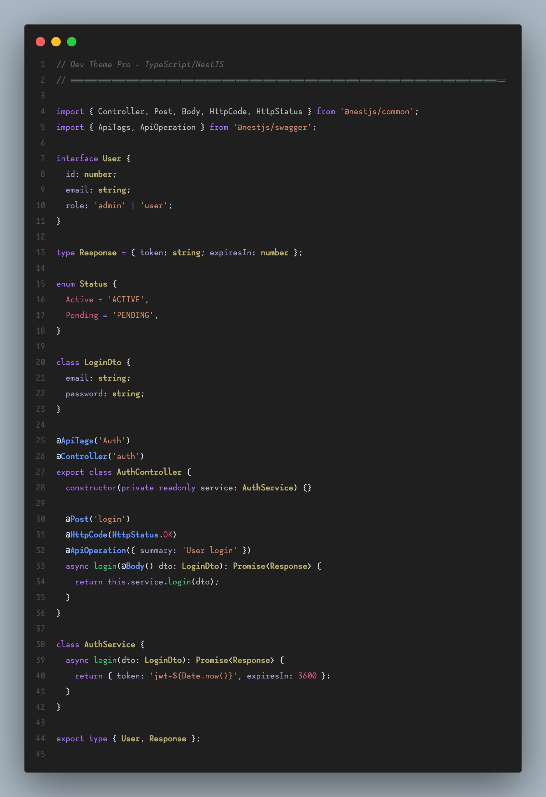
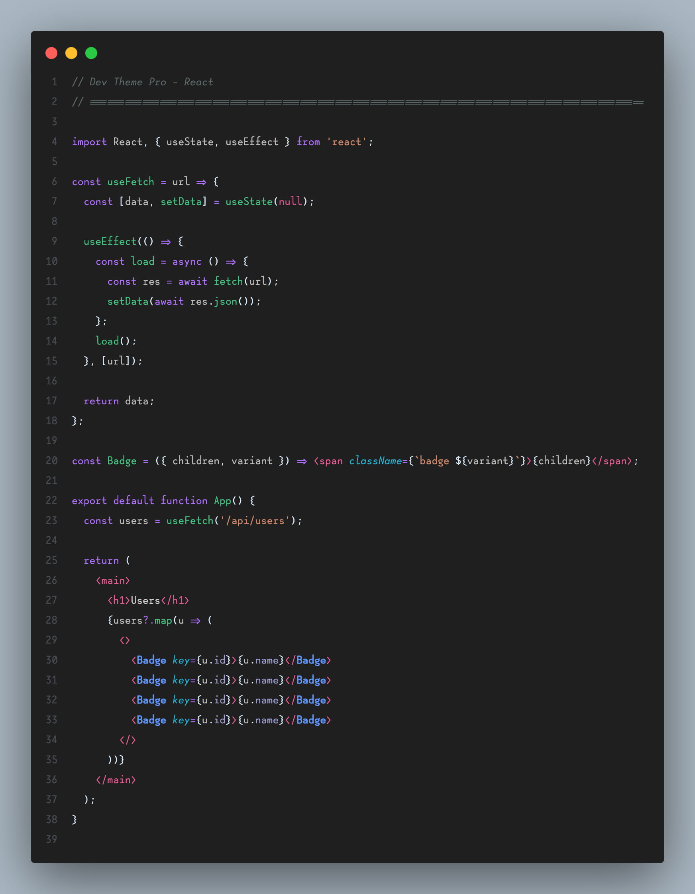
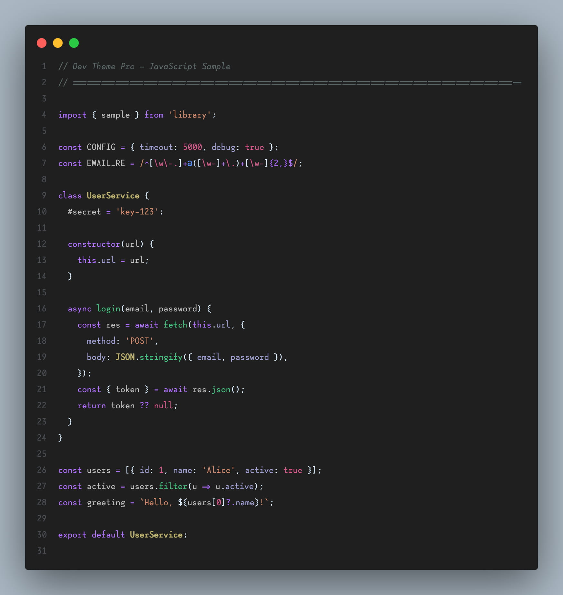
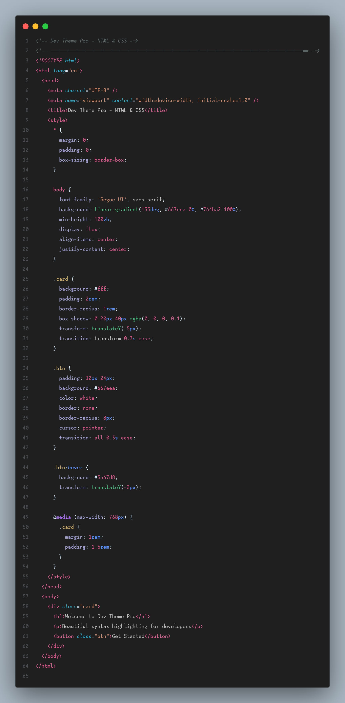
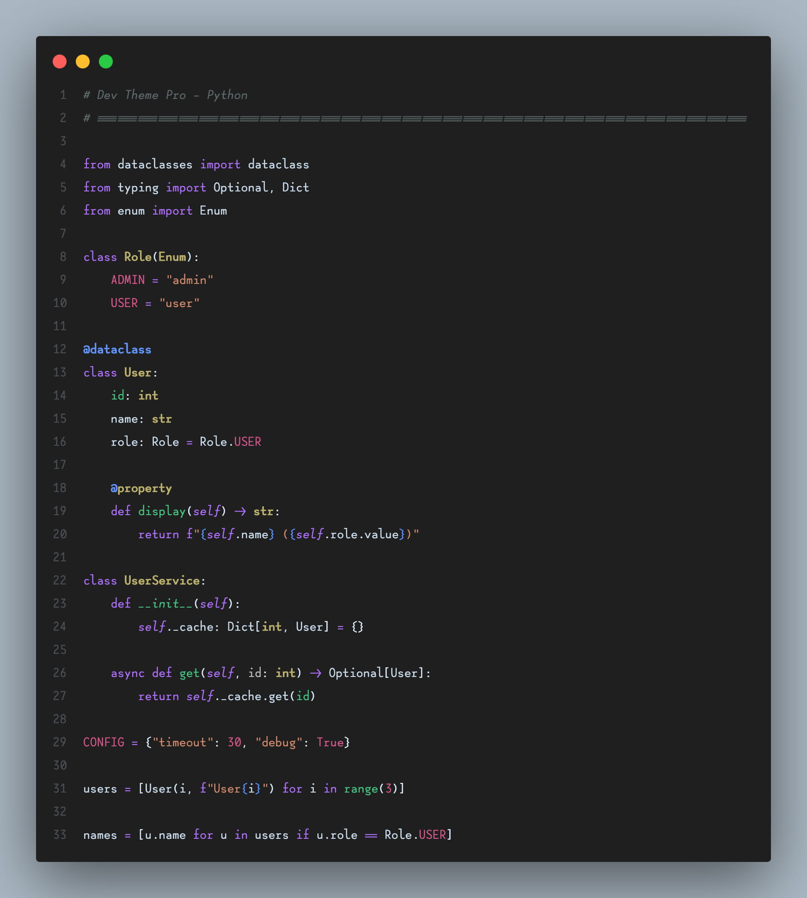

# Dev Theme Pro 🌌

A sleek, developer-friendly VS Code theme for modern coding with beautiful syntax highlighting and smooth color
transitions.


<p align="center">
  
</p>

## Screenshots

**TypeScript Preview** 

**React Preview** 

**JavaScript Preview** 

**HTML & CSS Preview** 

**Python Preview** 

## Installation

### Marketplace

1. Open VS Code → Extensions (`Ctrl+Shift+X` / `Cmd+Shift+X`)
2. Search `Dev Theme Pro`
3. Click Install
4. Go to `File → Preferences → Color Theme` and select **Dev Theme Pro Smooth**

### Manual

1. Download or clone this repo
2. Copy the theme to your VS Code extensions folder
3. Reload VS Code and select the theme

⭐ **Rate five-stars if you enjoy it!**

## Customize Colors

You can override colors in `settings.json`:

```json
"workbench.colorCustomizations": {
  "[Dev Theme Pro Smooth]": {
    "editor.background": "#1a1a2e",
    "sideBar.background": "#1a1a2e"
  }
}
```

### Recommended Settings

```json
"editor.fontFamily": "Lotion, Fira Code, JetBrains Mono",
"editor.fontLigatures": true,
"editor.fontSize": 14,
"editor.lineHeight": 30
```

### Enable Italics

```json
"editor.tokenColorCustomizations": {
  "[Dev Theme Pro Smooth]": {
    "textMateRules": [
      {
        "scope": ["comment", "keyword", "storage.modifier"],
        "settings": { "fontStyle": "italic" }
      }
    ]
  }
}
```

---

## Changelog

See [CHANGELOG.md](CHANGELOG.md) for release notes.

## Issues & Suggestions

Found a bug or have a feature request?  
👉 [Open an issue on GitHub](https://github.com/FaizanAshiq/dev-theme-pro/issues)

## Author

**Faizan Ashiq** — [LinkedIn](https://www.linkedin.com/in/faizan-ashiq/) · [GitHub](https://github.com/FaizanAshiq)

## License

MIT © Faizan Ashiq - [Full License](LICENSE.txt)

---

**Enjoying Dev Theme Pro?** ⭐ Star the repo and share feedback!

If you like this theme, please leave a review on the
[VS Code Marketplace](https://marketplace.visualstudio.com/items?itemName=FaizanAshiq.dev-theme-pro).
